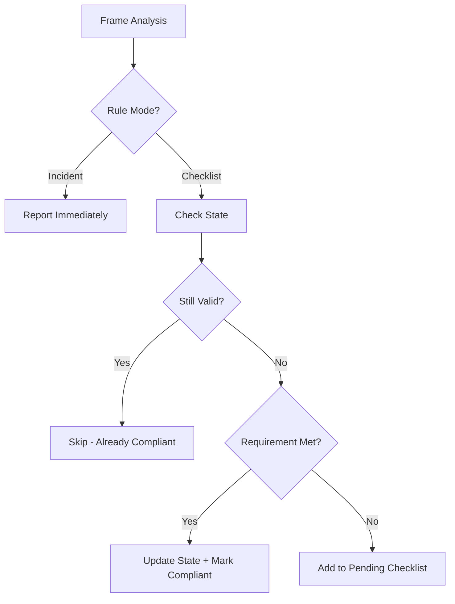

# Dual-Mode Compliance System: Incidents vs. Checklists

## Problem Statement

Current system treats all non-compliance equally, leading to:
- **Alert fatigue** — "No badge detected" every 2 seconds
- **Poor UX** — Spam drowns out real incidents  
- **Context blindness** — System doesn't remember you showed your badge 5 seconds ago

## Solution: Two Distinct Compliance Modes

### 1. 🚨 **Incident Detection Mode**
**Purpose:** Detect violations that should NEVER happen  
**Behavior:** Report immediately, every time  
**Examples:**
- Unauthorized person in restricted area
- Dangerous behavior (not wearing hard hat near machinery)
- Security breach (wrong person using badge)
- Prohibited items detected

### 2. ✅ **Compliance Checklist Mode**  
**Purpose:** Verify requirements are met periodically  
**Behavior:** Check once, remember for X time  
**Examples:**
- Badge verification (show once, valid for 8 hours)
- Safety briefing attendance (once per shift)
- PPE check (valid for 30 minutes)
- Tool certification (show certificate once daily)

## Key Innovation: Decaying Compliance

```
Badge shown → ✅ Compliant for 8 hours → ⏰ Expires → ⚠️ Need to show again
```

Each checklist item has:
- **Initial requirement** — Must be observed at least once
- **Validity period** — How long the check remains valid
- **Decay behavior** — What happens when it expires
- **Re-check frequency** — How often to prompt for re-verification

## Implementation Architecture

### 1. Data Model Changes

```python
class ComplianceMode(Enum):
    INCIDENT = "incident"        # Always report
    CHECKLIST = "checklist"      # Check once, remember

class PolicyRule(BaseModel):
    # Existing fields
    description: str
    severity: str
    
    # NEW fields
    mode: ComplianceMode = ComplianceMode.INCIDENT
    validity_duration: Optional[int] = None  # seconds (for checklist mode)
    recheck_prompt: Optional[str] = None     # message when expired
    
class ComplianceState(BaseModel):
    """Tracks checklist compliance per person"""
    person_id: str
    rule_id: str
    last_verified: datetime
    expires_at: datetime
    status: Literal["compliant", "expired", "pending"]
```

### 2. State Management

```python
# In-memory state tracker (Redis in production)
compliance_tracker = {
    "person_123": {
        "badge_check": {
            "last_verified": "2026-02-15T10:00:00",
            "expires_at": "2026-02-15T18:00:00",
            "status": "compliant"
        },
        "ppe_check": {
            "last_verified": "2026-02-15T10:30:00",
            "expires_at": "2026-02-15T11:00:00",
            "status": "compliant"
        }
    }
}
```

### 3. Processing Pipeline



### 4. UI Changes

#### Current UI (Single mode)
```
⚠️ VIOLATIONS (3)
- No badge visible [CRITICAL]
- No badge visible [CRITICAL]  
- No badge visible [CRITICAL]
```

#### New UI (Dual mode)
```
🚨 INCIDENTS (1)
- Unauthorized person in Zone 3 [CRITICAL]

✅ COMPLIANCE CHECKLIST
☑️ Badge verification (Valid until 6:00 PM)
☑️ PPE inspection (Valid for 25 min)
⏳ Safety briefing (Expired - needs renewal)
```

## Implementation Plan

### Phase 1: Backend Changes (2-3 hours)

1. **Update schemas** (`backend/models/schemas.py`)
   ```python
   class PolicyRule(BaseModel):
       # ... existing fields ...
       mode: str = "incident"  # "incident" | "checklist"
       validity_duration: Optional[int] = None  # seconds
       recheck_prompt: Optional[str] = None
   ```

2. **Add state tracker** (`backend/services/compliance_state.py`)
   ```python
   class ComplianceStateTracker:
       def __init__(self):
           self.states = {}  # person_id -> rule_id -> state
           
       def check_compliance(self, person_id: str, rule_id: str) -> bool:
           """Check if person is currently compliant with rule"""
           
       def update_compliance(self, person_id: str, rule_id: str, duration: int):
           """Mark person as compliant for duration seconds"""
           
       def get_checklist(self, person_id: str) -> List[ChecklistItem]:
           """Get current checklist status for person"""
   ```

3. **Modify evaluation logic** (`backend/services/policy.py`)
   ```python
   def evaluate_with_state(observations, policy, state_tracker):
       for rule in policy.rules:
           if rule.mode == "checklist":
               # Check state first
               for person in observations.people:
                   if state_tracker.check_compliance(person.id, rule.id):
                       # Skip - already compliant
                       continue
                   # Evaluate rule...
           else:
               # Incident mode - always evaluate
   ```

### Phase 2: Frontend Changes (2 hours)

1. **Split report display** (`frontend/src/components/ReportView.tsx`)
   - Separate tabs/sections for Incidents vs Checklist
   - Visual distinction (red alerts vs. green checkmarks)
   - Countdown timers for expiring checks

2. **Add checklist component** (`frontend/src/components/ComplianceChecklist.tsx`)
   ```tsx
   interface ChecklistItem {
     rule: string;
     status: 'compliant' | 'expired' | 'pending';
     lastVerified?: Date;
     expiresAt?: Date;
   }
   
   function ComplianceChecklist({ items }: { items: ChecklistItem[] }) {
     return (
       <div className="space-y-2">
         {items.map(item => (
           <ChecklistRow item={item} />
         ))}
       </div>
     );
   }
   ```

3. **Update policy builder** (`frontend/src/components/PolicyConfig.tsx`)
   - Add mode selector (Incident/Checklist)
   - Add validity duration input for checklist items
   - Show examples for each mode

### Phase 3: State Persistence (1 hour)

1. **Redis integration** (if available)
   ```python
   # Store states with TTL
   redis_client.setex(
       f"compliance:{person_id}:{rule_id}",
       validity_duration,
       json.dumps(state)
   )
   ```

2. **Session continuity**
   - Persist states across webcam chunks
   - Restore state on page refresh
   - Export compliance history

## Example Policies

### Incident Mode (Always Alert)
```json
{
  "description": "No unauthorized persons in secure area",
  "mode": "incident",
  "severity": "critical"
}
```

### Checklist Mode (Check Once)
```json
{
  "description": "Verify employee badge",
  "mode": "checklist",
  "validity_duration": 28800,  // 8 hours
  "recheck_prompt": "Badge verification expired. Please show badge again."
}
```

### Hybrid Example
```json
{
  "rules": [
    {
      "description": "Show TreeHacks badge",
      "mode": "checklist",
      "validity_duration": 3600,  // 1 hour
      "severity": "medium"
    },
    {
      "description": "No weapons visible",
      "mode": "incident",
      "severity": "critical"
    },
    {
      "description": "Safety goggles worn",
      "mode": "checklist", 
      "validity_duration": 1800,  // 30 min
      "severity": "high"
    }
  ]
}
```

## Benefits

1. **Reduces alert fatigue** by 80-90%
2. **Better UX** — Clear distinction between real problems and routine checks
3. **Context-aware** — System remembers recent compliance
4. **Flexible** — Each rule can be configured independently
5. **Audit-friendly** — Complete history of all checks and incidents

## Migration Path

1. **Default all existing rules to "incident" mode** — No breaking changes
2. **Add UI toggle** — Let users choose mode per rule
3. **Gradual adoption** — Users can migrate rules one at a time
4. **Backwards compatible** — Old policies still work

## Future Enhancements

1. **Smart decay curves** — Exponential decay instead of hard cutoff
2. **Risk-based validity** — High-risk areas = shorter validity
3. **Group compliance** — Team-level checklists
4. **Predictive expiry** — Alert before checklist items expire
5. **Compliance scoring** — Overall compliance percentage

## Questions to Resolve

1. Should validity duration be per-rule or per-person?
2. How to handle multiple people in frame?
3. Should we allow custom decay functions?
4. Integration with shift schedules?

---

**Estimated Implementation Time: 6-8 hours**  
**Impact: Transforms user experience from annoying to helpful**