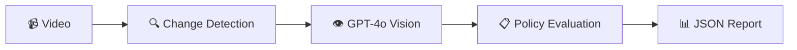
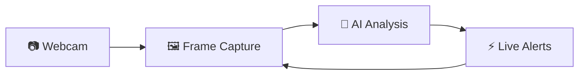

<div align="center">

# 🕵️‍♂️ Agent 00Vision

### AI-Powered Video Compliance Monitoring Platform

[](https://www.python.org/)
[](https://fastapi.tiangolo.com/)
[](https://reactjs.org/)
[](https://openai.com/)
[](LICENSE)

**Define any compliance policy in plain English. Point it at any camera. Get structured, audit-ready reports automatically.**

[Quick Start](#-quick-start) • [Features](#-features) • [Demo](#-demo) • [API](#-api-endpoints) • [Architecture](#-architecture)

</div>

---

## 🚀 Quick Start

### Prerequisites
- **Python 3.10+**
- **Node.js 18+**
- **OpenAI API key**

### Optional (for full features)
- **Redis** — for async processing & background jobs
- **ffmpeg** — for audio/speech compliance

### 1-Minute Setup

```bash
# Clone the repository
git clone https://github.com/kuzeykantarcioglu/treehacks2026.git
cd treehacks2026

# Set up environment
echo "OPENAI_API_KEY=sk-your-key-here" > .env

# Install backend dependencies
python -m venv venv
source venv/bin/activate  # Windows: venv\Scripts\activate
pip install -r backend/requirements.txt

# Install frontend dependencies
cd frontend && npm install && cd ..

# Start the app (2 terminals needed)

# Terminal 1: Backend API (port 8000)
PYTHONPATH=/path/to/treehacks2026 uvicorn backend.main:app --reload --host 0.0.0.0 --port 8000

# Terminal 2: Frontend
cd frontend && npm run dev

# Optional: For async features (Redis + Celery)
# Terminal 3: Start Redis
redis-server

# Terminal 4: Start Celery worker
celery -A backend.services.celery_app worker --loglevel=info
```

🎉 **Open http://localhost:5173** — You're ready to go!

---

## ✨ Features

<table>
<tr>
<td width="50%">

### 🎯 Core Capabilities
- **Natural language policies** — Write rules in plain English
- **Real-time monitoring** — Live webcam analysis with instant alerts  
- **Visual reference matching** — Upload photos of authorized people/badges
- **Audio compliance** — Whisper transcription for speech rules
- **Async processing** — Queue large videos, get results via WebSocket
- **Smart frame sampling** — 80-95% cost reduction via change detection

</td>
<td width="50%">

### 🛡️ Production Features
- **Retry logic** — Exponential backoff for API failures
- **Rate limiting** — Stay within OpenAI quotas
- **Usage tracking** — Monitor API costs in real-time
- **Error recovery** — Webcam sessions survive failures
- **Background jobs** — Celery + Redis for async processing
- **WebSocket updates** — Real-time progress notifications

</td>
</tr>
</table>

---

## 🎬 Demo

<div align="center">

### File Analysis Mode
Upload a video → Configure policy → Get structured report



### Live Monitoring Mode
Webcam → Real-time analysis → Continuous compliance tracking



</div>

---

## 🏗️ Architecture

```
┌─────────────────────────────────────────────────────────────┐
│                         FRONTEND                             │
│  React + TypeScript + Tailwind + Vite                       │
│  • Policy builder   • Live monitoring   • Report viewer     │
└─────────────────┬───────────────────────────────────────────┘
                  │ HTTP / WebSocket
┌─────────────────▼───────────────────────────────────────────┐
│                         BACKEND                              │
│  FastAPI + Celery + Redis                                   │
│  • /analyze         → Sync analysis (small videos)          │
│  • /async/analyze   → Async with task queue                 │
│  • /ws/task/{id}    → Real-time updates                    │
└─────────────────┬───────────────────────────────────────────┘
                  │
┌─────────────────▼───────────────────────────────────────────┐
│                    PROCESSING PIPELINE                       │
│                                                              │
│  1. Change Detection (OpenCV)                               │
│     → 80-95% frame reduction                                │
│                                                              │
│  2. Visual Analysis (GPT-4o Vision)                         │
│     → Scene understanding + person tracking                 │
│                                                              │
│  3. Audio Transcription (Whisper)                          │
│     → Speech-to-text for verbal compliance                  │
│                                                              │
│  4. Policy Evaluation (GPT-4o-mini)                        │
│     → Rule checking + report generation                     │
└──────────────────────────────────────────────────────────────┘
```

---

## 📡 API Endpoints

### Core Endpoints

| Method | Path | Description | Mode |
|--------|------|-------------|------|
| `POST` | `/analyze/` | Full video analysis pipeline | Synchronous |
| `POST` | `/analyze/frame` | Single frame analysis (webcam) | Synchronous |
| `POST` | `/async/analyze` | Queue video for processing | Asynchronous |
| `GET` | `/async/status/{task_id}` | Check task progress | Polling |
| `WS` | `/ws/task/{task_id}` | Real-time task updates | WebSocket |
| `POST` | `/polly/chat` | AI policy assistant | Synchronous |

### Example: Async Analysis

```python
# 1. Start analysis
response = requests.post(
    "http://localhost:8000/async/analyze",
    files={"video": open("video.mp4", "rb")},
    data={"policy_json": json.dumps(policy)}
)
task_id = response.json()["task_id"]

# 2. Connect WebSocket for updates
ws = websocket.WebSocket()
ws.connect(f"ws://localhost:8000/ws/task/{task_id}")

# 3. Receive real-time progress
while True:
    update = json.loads(ws.recv())
    print(f"Progress: {update['progress']['stage']} - {update['progress']['progress']}%")
    if update['ready']:
        break
```

---

## ⚙️ Configuration

### Environment Variables

```bash
# .env file
OPENAI_API_KEY=sk-your-key-here
REDIS_URL=redis://localhost:6379/0
UPLOAD_DIR=./uploads
KEYFRAMES_DIR=./keyframes
```

### Change Detection Tuning

```python
# backend/services/video.py
PARAMS = {
    "sample_interval": 0.3,      # Sample every 0.3s
    "change_threshold": 0.10,    # Sensitivity (0-1)
    "min_change_interval": 0.5,  # Debounce time
    "max_gap": 10.0,            # Max seconds without keyframe
}
```

### Rate Limiting

```python
# backend/services/api_utils.py
LIMITS = {
    "max_per_minute": 30,
    "max_per_hour": 500,
    "max_retries": 3,
    "initial_delay": 1.0,
}
```

---

## 📁 Project Structure

```
compliance_vision/
├── 🎨 frontend/               # React UI
│   ├── src/
│   │   ├── App.tsx           # Main app with monitoring loop
│   │   ├── api.ts            # Backend API client
│   │   ├── api-async.ts      # Async + WebSocket client
│   │   └── components/
│   │       ├── PolicyConfig.tsx      # Rule builder
│   │       ├── LiveReportView.tsx    # Real-time monitor
│   │       └── AsyncAnalysis.tsx     # Async upload UI
│   └── package.json
│
├── ⚙️ backend/                # FastAPI server
│   ├── main.py               # App entry point
│   ├── routers/
│   │   ├── analyze.py        # Video analysis endpoints
│   │   ├── async_analyze.py  # Async task endpoints
│   │   └── websocket.py      # WebSocket handlers
│   ├── services/
│   │   ├── video.py          # Change detection
│   │   ├── vlm.py            # GPT-4o vision
│   │   ├── policy.py         # Compliance evaluation
│   │   ├── api_utils.py      # Retry + rate limiting
│   │   ├── celery_app.py     # Task queue config
│   │   └── celery_tasks.py   # Async workers
│   └── models/
│       └── schemas.py        # Pydantic models
│
├── 🎬 scene_detection.py      # OpenCV change detection
├── 🚀 start-services.sh       # Quick start script
├── 📋 requirements.txt        # Python dependencies
└── 📄 .env.example           # Environment template
```

---

## 🔥 Performance Optimizations

| Optimization | Impact | Details |
|-------------|--------|---------|
| **Smart Frame Sampling** | 80-95% ↓ API calls | Dual-metric change detection (histogram + structural) |
| **Threaded Pipeline** | 2-3x ↑ throughput | Parallel read → detect → write operations |
| **Early Termination** | 50% ↓ CPU usage | Skip expensive diff when histogram shows no change |
| **Ring Buffer Capture** | 0% memory leaks | Fixed-size buffer for live streams |
| **Batch API Calls** | 60% ↓ latency | Process 5 frames per GPT-4o call |
| **Combined Analysis** | 30% ↓ round-trips | VLM + policy eval in single call for webcam |

---

## 🛠️ Development

### Install Development Dependencies

```bash
# Backend
pip install pytest black mypy

# Frontend  
npm install --save-dev @types/react prettier eslint
```

### Run Tests

```bash
# Backend tests
pytest backend/tests/

# Frontend tests
cd frontend && npm test
```

### Code Formatting

```bash
# Python
black backend/

# TypeScript/React
cd frontend && npm run format
```

---

## 📈 Monitoring & Debugging

### Check System Health

```bash
curl http://localhost:8000/health
```

Response:
```json
{
  "status": "ok",
  "openai_key_set": true,
  "redis": "connected",
  "celery_workers": 2,
  "api_usage": {
    "vlm": {"total_calls": 42, "total_cost": 1.23},
    "policy_eval": {"total_calls": 38, "total_cost": 0.45}
  }
}
```

### Monitor Celery Tasks

```bash
# Watch worker logs
tail -f celery.log

# Check queue stats
celery -A backend.services.celery_app inspect active

# Flower web UI (optional)
pip install flower
celery -A backend.services.celery_app flower
```

---

## 🤝 Contributing

We welcome contributions! Please see our [Contributing Guide](CONTRIBUTING.md) for details.

1. Fork the repository
2. Create a feature branch (`git checkout -b feature/amazing-feature`)
3. Commit your changes (`git commit -m 'Add amazing feature'`)
4. Push to the branch (`git push origin feature/amazing-feature`)
5. Open a Pull Request

---

## 📄 License

MIT License - see [LICENSE](LICENSE) for details.

---

## 🙏 Acknowledgments

- Built with [OpenAI GPT-4o](https://openai.com/) for vision analysis
- [FastAPI](https://fastapi.tiangolo.com/) for the backend framework
- [React](https://reactjs.org/) + [Vite](https://vitejs.dev/) for the frontend
- [Celery](https://docs.celeryproject.org/) + [Redis](https://redis.io/) for async processing

---

<div align="center">

**Built for TreeHacks 2026** 🌲

[Report Issues](https://github.com/kuzeykantarcioglu/compliance_vision_cloud/issues) • [Request Features](https://github.com/kuzeykantarcioglu/compliance_vision_cloud/issues) • [Star on GitHub](https://github.com/kuzeykantarcioglu/compliance_vision_cloud)

</div>